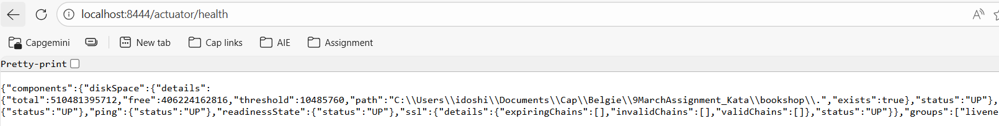
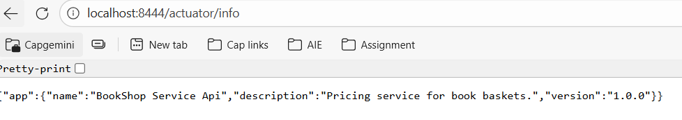

# Book Pricing API

## Overview

The **Book Pricing API** is a Spring Boot-based web application that calculates the total price of a collection of books while applying the appropriate discounts. The project is developed using Java 21, relies on Maven as its build system, and uses OpenAPI 3.0 to generate API documentation. The application is implemented following a Test-Driven Development (TDD) approach to ensure high code quality, maintainability, and reliability.
## Project Goals

- **Provide a REST API** to calculate a discount and get the best price.
- **Expose the API via Swagger** for easy testing and exploration.

## Features

- **Calculate Price:**  
  Computes the total price for a basket of books with discount rules applied for different groups of distinct titles.

- **REST API:**  
  Exposes a POST endpoint to calculate the price of the basket.

- **OpenAPI Documentation:**  
  The API is documented using an OpenAPI YAML file. Interactive documentation is available via Swagger UI.

- **Global Error Handling:**  
  Provides standardized error responses using a global `ErrorResponse` DTO.

## Technologies Used

- **Java 21**
- **Spring Boot 4.0.3**
- **Maven** 3+
- **springdoc-openapi-starter-webmvc-ui** for interactive API documentation


## Running the application

Clone the repository to your local

```
https://github.com/Ishwari96/Book-Pricing-API.git

```

Go to root directory of the code. Run following command to run the application.

```
mvn clean install

```

Now the application is build to run. Use following command to run spring boot application on command prompt.

```
mvn spring-boot:run

```

In case, If you want to run the application directly from IDE. Import the project to your favorite IDE as 'Existing maven project'. Select project from the IDE and run it as java application. “Don't forget to update maven ;)” I have configured the port to 8444 in properties. So the application can be accessed by `http://localhost:8444`

- `http://localhost:8444`

Swagger is integrated for easy access of API. It can be accessed via `http://localhost:8444/swagger-ui/index.html#/`

Actuator is enabled in order to make production ready - http://localhost:8444/actuator http://localhost:8444/actuator/health http://localhost:8444/actuator/metrics



http://localhost:8444/actuator/info

## Authorization Details

Basic authentication is implemented. You can access the api on the through following user details. This is only for demo purpose. I have disabled the case sensitivity for username and password for testing purpose. It is not supposed to be used in production environment.

- username: user1
- password: user1Pass


## Assumptions & Design Decisions
- API Contract–First Approach (OpenAPI YAML)
This project started using a contract‑first methodology.
I defined the API contract in openapi.yml and included the standard OpenAPI generator dependency, which produced:

- Although Controller stubs, DTOs, API were successfully generated, I intentionally chose not to use them in the final implementation.
- I wanted the reviewer to clearly see my own implementation, structure, and coding style.
- The generated classes often contain extra layers and annotations that can distract from the actual business logic.
- Instead of relying on generation tooling, I manually created the classes
- integrations tests are written in IT package to test the API endpoints as defined in the OpenAPI contract.


### Pricing Assumption
To simplify calculations, I introduced the property:
- book.unit.price=50.0 in properties file

## API Usage

### Endpoint: Calculate Price

- **URL:** `/api/v1/books/calculate-price`
- **Method:** `POST`
- **Request Body:**


 ```json
  {
    "basket": {
      "Clean Code": 2,
      "The Clean Coder": 2,
      "Clean Architecture": 2,
      "Test Driven Development by Example": 1,
      "Working Effectively With Legacy Code": 1
    }
  }
  ```

- **Response:**  
  Returns a number representing the calculated price.

### Error Responses

In case of errors, the API returns a standardized JSON error response. For example:

```
{
  "status": 400,
  "error": "Bad Request",
  "message": "Basket is empty."
}
```
## Future enhancements
The current implementation meets the assignment requirements, but there are several meaningful improvements that can be added to make the system more robust, scalable, and production‑ready.
- Use BigDecimal Instead of double for Price Calculations
Currently, book prices and discount calculations use double.
For financial calculations, BigDecimal is the industry standard because it avoids floating‑point rounding errors
provides precise arithmetic for currency
enables rounding modes (HALF_UP, HALF_EVEN, etc.)

- Accept Book Price From Client Instead of Property File
Right now, the unit price is fixed via: property
A more flexible system could: Receive price from the front‑end (client request)


- Extend OpenAPI Usage
Even though OpenAPI YAML was used for the initial contract, future enhancements could include: generating DTOs and controllers from the contract
auto-validating schemas
publishing OpenAPI through CI/CD
integrating Swagger UI with versioning


- Connect to Real Book Catalog
Database ( PostgreSQL / MySQL )
External book metadata API
Internal book service in a microservice architecture